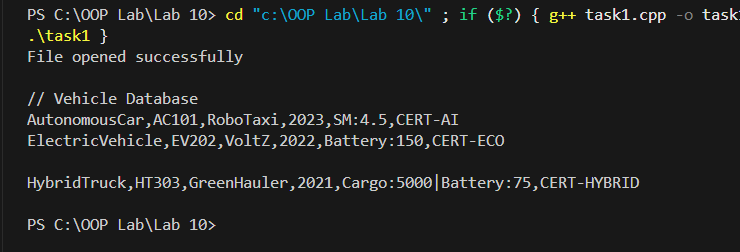
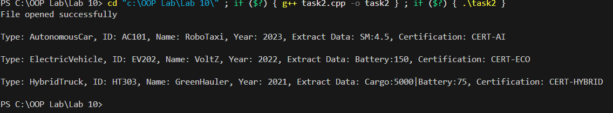
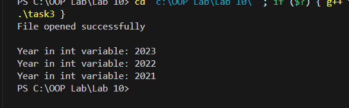
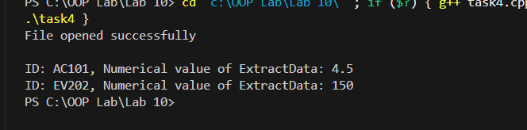
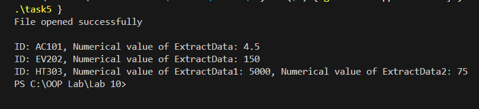
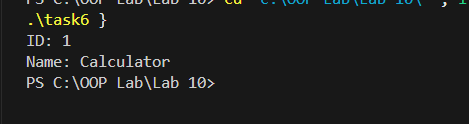
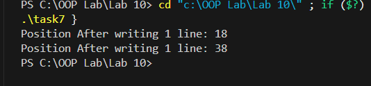
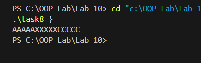
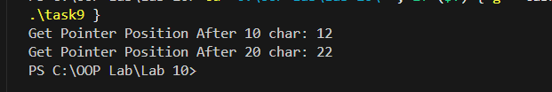
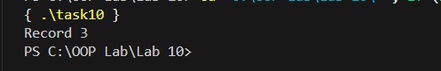

**OOP Lab \# 10**

**Task 1:**

{width="6.268055555555556in"
height="2.134027777777778in"}

**Task 2:**

{width="6.268055555555556in"
height="1.163888888888889in"}

**Task 3:**

{width="6.136272965879265in"
height="1.906515748031496in"}

**Task 4:**

{width="6.268055555555556in"
height="1.5479166666666666in"}

**Task 5:**

{width="6.268055555555556in"
height="1.4270833333333333in"}

**Task 6:**

{width="4.886099081364829in"
height="1.2918471128608924in"}

**Task 7:**

{width="5.563276465441819in"
height="1.2918471128608924in"}

**Task 8:**

{width="4.177666229221347in"
height="1.3231014873140858in"}

**Task 9:**

{width="6.268055555555556in"
height="1.0493055555555555in"}

**Task 10:**

{width="5.177806211723534in"
height="0.8438681102362204in"}
