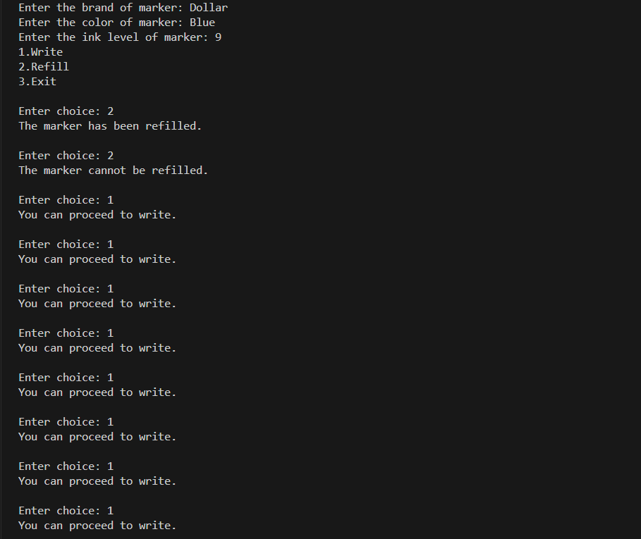
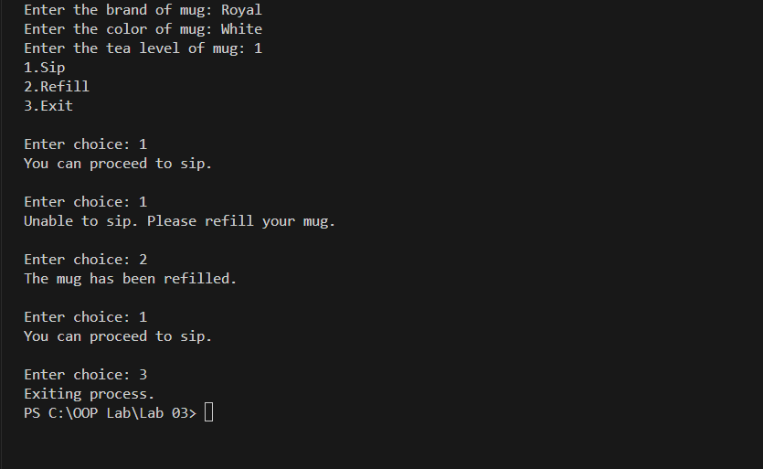
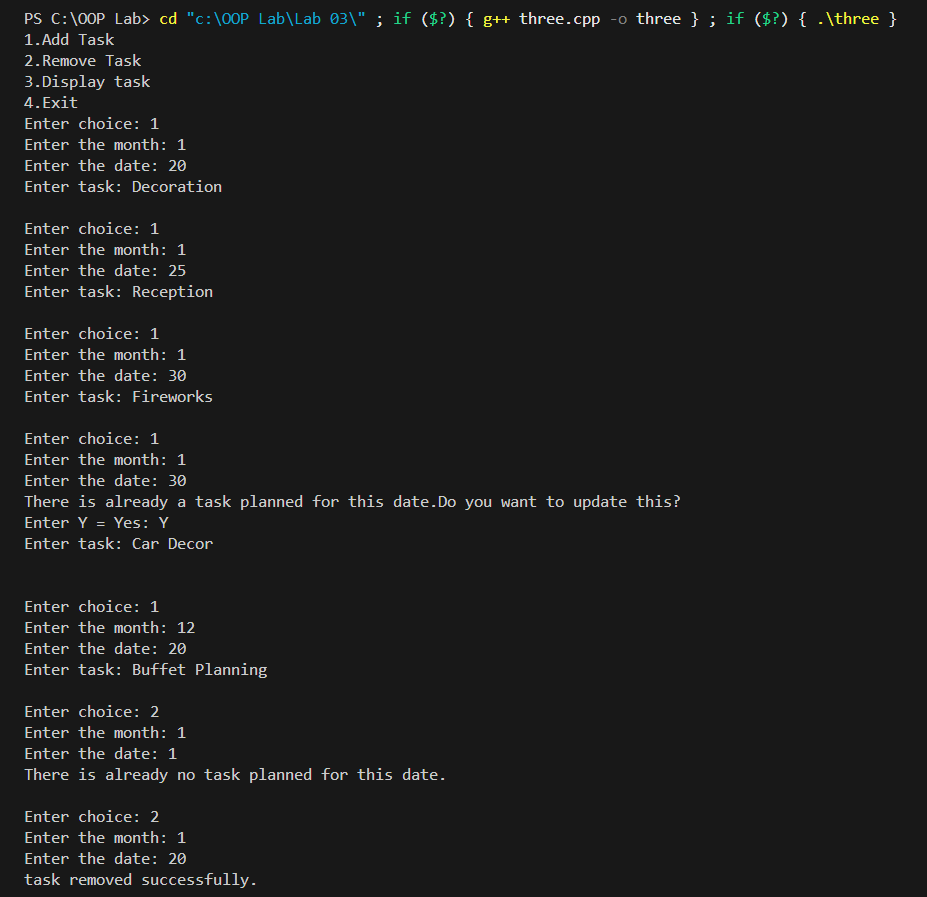
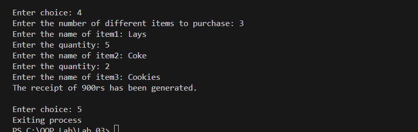

**OOP LAB \# 3**

**Name: Huzaifa Shahid**

**Roll Number: 24K-0860**

**Task \# 1:**

{width="6.268055555555556in" height="5.275in"}

{width="6.268055555555556in"
height="1.3527777777777779in"}

**Task \# 2:\**

{width="6.268055555555556in"
height="3.8513888888888888in"}

**Task \# 3:**

{width="6.268055555555556in"
height="6.065277777777778in"}

{width="6.268055555555556in"
height="5.791666666666667in"}

**Task \# 4:**

{width="6.268055555555556in"
height="5.810416666666667in"}

{width="6.268055555555556in"
height="1.8791666666666667in"}

**Task \# 5:**

{width="6.268055555555556in"
height="4.551388888888889in"}

{width="6.268055555555556in"
height="1.988888888888889in"}
