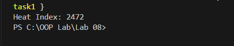
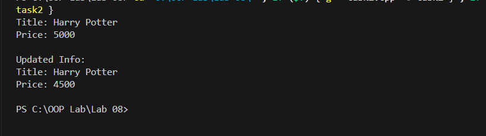
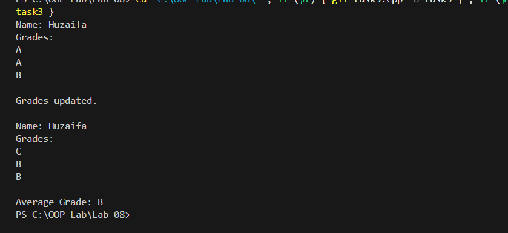
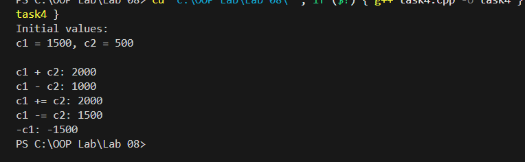
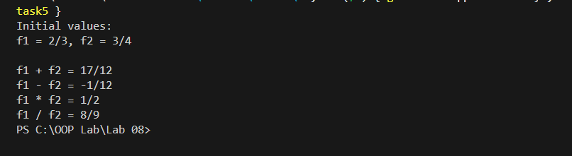

**OOP Lab 8**

**Task \# 1:\
**{width="4.969443350831146in"
height="0.9793033683289589in"}

**Task \# 2:**

{width="6.268055555555556in"
height="1.7604166666666667in"}

**Task \# 3:**

{width="6.268055555555556in"
height="2.8833333333333333in"}

**Task \# 4:\
**{width="6.268055555555556in"
height="1.9361111111111111in"}

**Task \# 5:**

{width="6.268055555555556in" height="1.71875in"}
