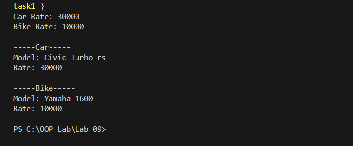
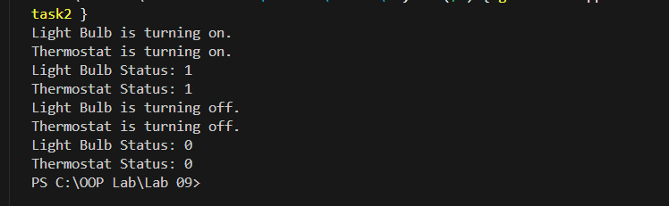
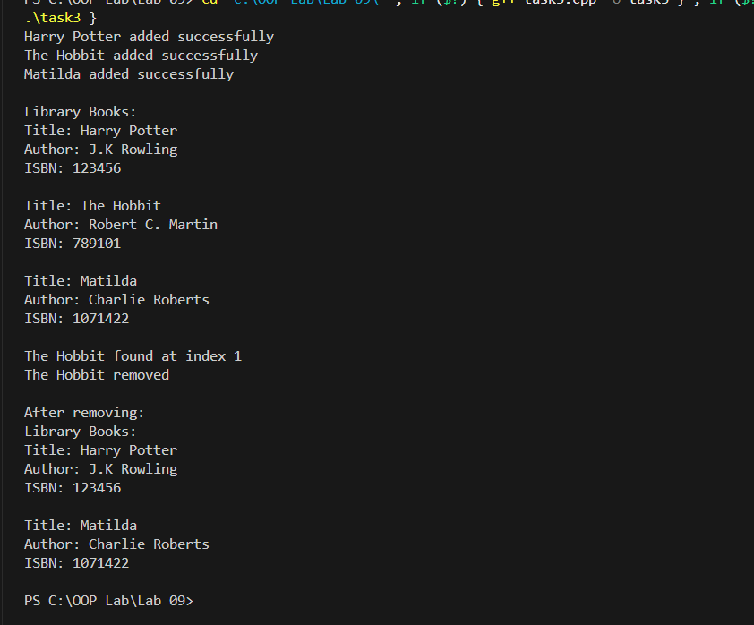
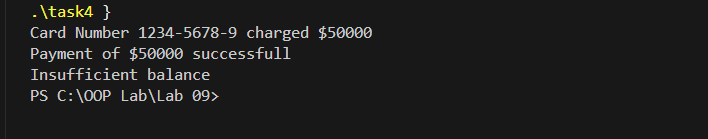
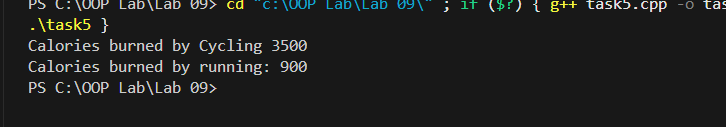

**OOP Lab 09**

**Task 1:\
**{width="6.268055555555556in"
height="2.602777777777778in"}

**Task 2:\
**{width="6.268055555555556in"
height="1.9354166666666666in"}

**Task 3:**

{width="6.268055555555556in"
height="5.195833333333334in"}

**Task 4:\
**{width="6.268055555555556in"
height="1.2305555555555556in"}

**Task 5:\
**{width="6.268055555555556in"
height="1.0965277777777778in"}
