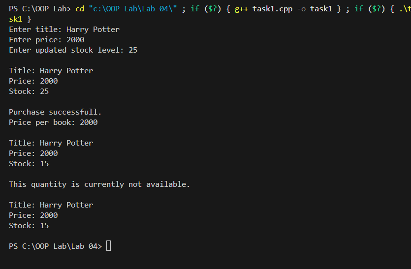
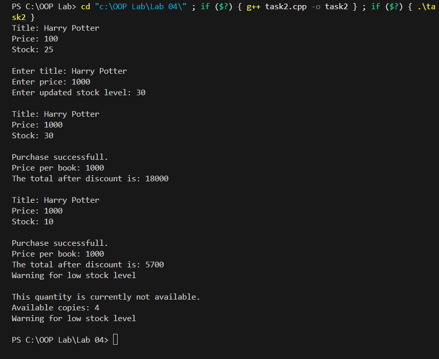
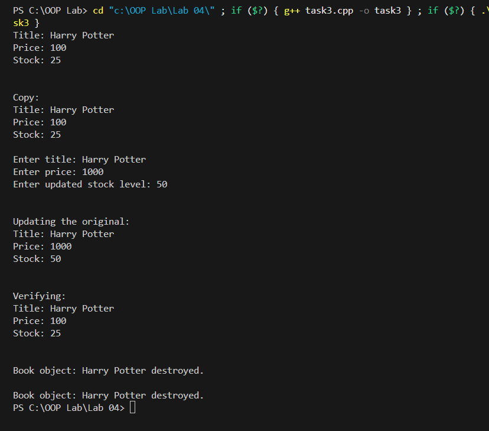
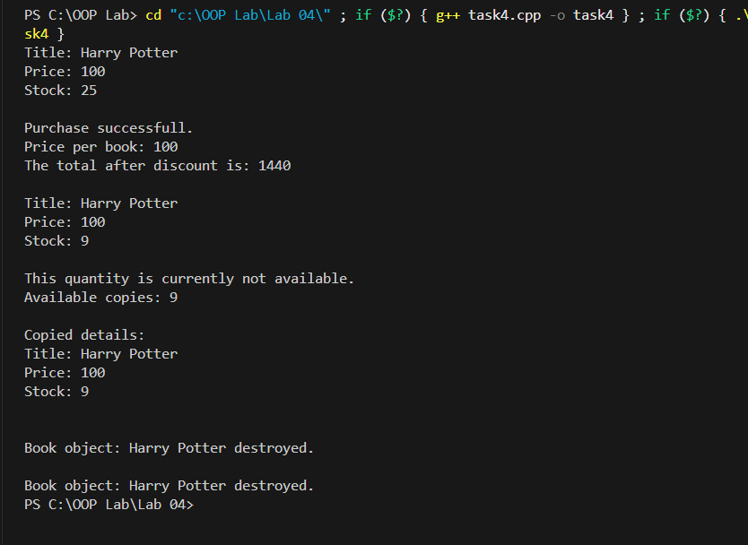
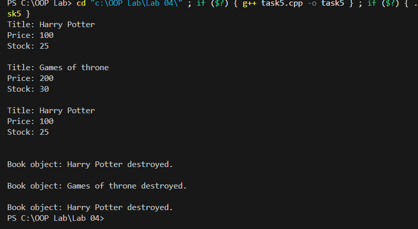

**OOP Lab \# 4**

**Task \# 1:**

{width="6.268055555555556in" height="4.10625in"}

**Task \# 2:\
**{width="6.268055555555556in"
height="5.121527777777778in"}

**Task \# 3:\
**{width="6.268055555555556in"
height="5.51875in"}

**Task \# 4:\
**{width="6.268055555555556in"
height="4.569444444444445in"}

**Task \# 5:\
**{width="6.268055555555556in" height="3.4375in"}
